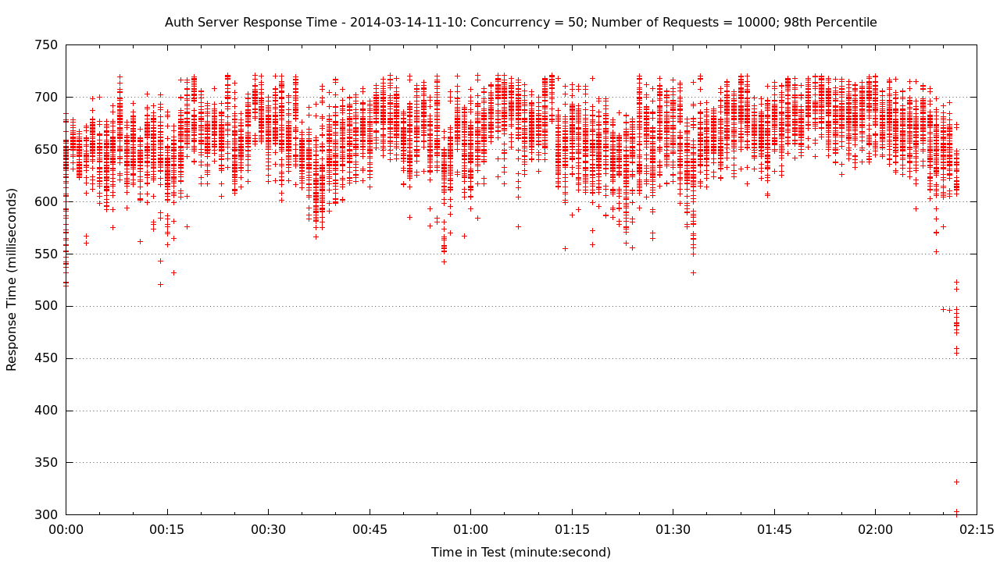
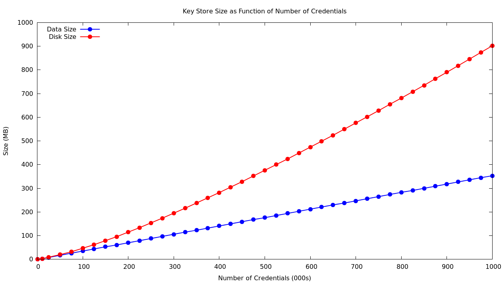

Testing and experimenting with a full yar deployment
is done by creating a series of
[Docker](https://www.docker.io/) containers to run
instances of the various yar services. The number, type
and size of these containers can be varied to validate
yar's operation in various deployment configurations.
The intended deployment OS for yar is
[Ubuntu 12.04](http://releases.ubuntu.com/12.04/)
and therefore the Docker containers run this OS.

Creating a Box with Correct Linux Kernel
----------------------------------------

The primary development environment for yar is
[Mac OS X](http://www.apple.com/ca/osx/).
[Docker](https://www.docker.io/) doesn't support
[Mac OS X](http://www.apple.com/ca/osx/)
so a [Vagrant](http://www.vagrantup.com/) provisioned
[VirtualBox](https://www.virtualbox.org/)
VM running [Ubuntu 12.04](http://releases.ubuntu.com/12.04/) is
used as the [Docker](https://www.docker.io/) container host. 
There's one little gotcha to address = the default
[Ubuntu 12.04](http://releases.ubuntu.com/12.04/)
[box](http://docs.vagrantup.com/v2/boxes.html)
runs the 3.2 Linux kernel but 
[Docker requires](http://docs.docker.io/en/latest/installation/ubuntulinux/)
version 3.8 of the Linux kernel. So, we need create a local
[Ubuntu 12.04](http://releases.ubuntu.com/12.04/)
[box](http://docs.vagrantup.com/v2/boxes.html)
with the 3.8 Linux kernel.
Let's walk through this process step by step.
We'll assume you don't have the yar source code on your machine.

* get the source code and pre-reqs by running the
following in a new terminal window

~~~~~
cd; git clone https://github.com/simonsdave/yar.git; cd yar; source bin/cfg4dev
~~~~~

* use [Vagrant](http://www.vagrantup.com/) to provision
a [Ubuntu 12.04](http://releases.ubuntu.com/12.04/)
[box](http://docs.vagrantup.com/v2/boxes.html)
with version 3.8 of the Linux kernel

~~~~~
(env)>cd tests/load/precise64-3.8-kernel
(env)>vagrant up
<<<lots of messages>>>
(env)>vagrant status
Current machine states:
default                   running (virtualbox)
~~~~~

* use [Vagrant](http://www.vagrantup.com/)'s
[package](https://docs.vagrantup.com/v2/cli/package.html)
command to create a
[box](http://docs.vagrantup.com/v2/boxes.html)

~~~~~
(env)>vagrant package --output precise64-3.8-kernel.box
[default] Attempting graceful shutdown of VM...
[default] Clearing any previously set forwarded ports...
[default] Creating temporary directory for export...
[default] Exporting VM...
[default] Compressing package to: /Users/dave/yar/tests/load/precise64-3.8-kernel/precise64-3.8-kernel.box
(env)>ls -l
total 1145888
-rw-r--r--  1 dave  staff        381 14 Mar 07:59 Vagrantfile
-rw-r--r--  1 dave  staff  586685947 14 Mar 09:24 precise64-3.8-kernel.box
-rw-r--r--  1 dave  staff        184 14 Mar 07:59 provision.sh
(env)>
~~~~~

* use [Vagrant](http://www.vagrantup.com/)'s
[box add](https://docs.vagrantup.com/v2/cli/box.html)
command to add the
[box](http://docs.vagrantup.com/v2/boxes.html)
to the local repo of boxes

> in the code below it's important to get the 
> [box](http://docs.vagrantup.com/v2/boxes.html)
> name *precise64-3.8-kernel* right because
> it's referred to by name in
> [this Vagrantfile](Vagrantfile.sh)

~~~~~
(env)>vagrant box list
precise64 (virtualbox)
ubuntu    (virtualbox)
(env)>vagrant box add precise64-3.8-kernel precise64-3.8-kernel.box
Downloading or copying the box...
Extracting box...te: 136M/s, Estimated time remaining: 0:00:01)
Successfully added box 'precise64-3.8-kernel' with provider 'virtualbox'!
(env)>vagrant box list
precise64            (virtualbox)
precise64-3.8-kernel (virtualbox)
ubuntu               (virtualbox)
(env)>
~~~~~

Creating a Docker Container Host Box
------------------------------------

Let's walk through this process step by step
assuming you don't have the yar source code on your machine.

* get the source code and pre-reqs by running the
following in a new terminal window

~~~~~
cd; git clone https://github.com/simonsdave/yar.git; cd yar; source bin/cfg4dev
~~~~~

* use [Vagrant](http://www.vagrantup.com/) to spin up
the [VirtualBox](https://www.virtualbox.org/)
[box](http://docs.vagrantup.com/v2/boxes.html)
that will become the docker container host

~~~~~
(env)>cd tests/load/docker-container-host
(env)>vagrant up
<<<lots of messages>>>
Processing triggers for libc-bin ...
ldconfig deferred processing now taking place
(env)>vagrant status
Current machine states:
default                   running (virtualbox)

The VM is running. To stop this VM, you can run `vagrant halt` to
shut it down forcefully, or you can run `vagrant suspend` to simply
suspend the virtual machine. In either case, to restart it again,
simply run `vagrant up`.
~~~~~

* use [Vagrant](http://www.vagrantup.com/)'s
[package](https://docs.vagrantup.com/v2/cli/package.html)
command to create the
[box](http://docs.vagrantup.com/v2/boxes.html)

~~~~~
(env)>vagrant package --output docker-container-host.box
[default] Attempting graceful shutdown of VM...
[default] Clearing any previously set forwarded ports...
[default] Creating temporary directory for export...
[default] Exporting VM...
[default] Compressing package to: /Users/dave/yar/tests/load/docker-container-host/docker-container-host.box
(env)>
~~~~~

* use [Vagrant](http://www.vagrantup.com/)'s
[box add](https://docs.vagrantup.com/v2/cli/box.html)
command to add the
[box](http://docs.vagrantup.com/v2/boxes.html)
to the local repo of boxes

> in the code below it's important to get the 
> [box](http://docs.vagrantup.com/v2/boxes.html)
> name *docker-container-host* right because
> it's referred to by name in
> [this Vagrantfile](Vagrantfile.sh)

~~~~~
(env)>vagrant box list
awsec2               (aws)
precise64            (virtualbox)
precise64-3.8-kernel (virtualbox)
(env)>vagrant box add docker-container-host docker-container-host.box
Downloading or copying the box...
Extracting box...te: 26.2M/s, Estimated time remaining: 0:00:01)
Successfully added box 'docker-container-host' with provider 'virtualbox'!
(env)>vagrant box list
awsec2                (aws)
docker-container-host (virtualbox)
precise64             (virtualbox)
precise64-3.8-kernel  (virtualbox)
(env)>
~~~~~

Running a Load Test
-------------------

With the above instructions we now have a
[Vagrant](http://www.vagrantup.com/)
[box](http://docs.vagrantup.com/v2/boxes.html)
running [Ubuntu 12.04](http://releases.ubuntu.com/12.04/)
and 90% of what we need to run a load test.
Let's walk through the process of spinning up
a VM to run a load test.
We'll assume you're doing this from ground zero and don't even have
the yar source installed on your machine.

* get the source code by running the following in a new terminal window

~~~~~
cd; git clone https://github.com/simonsdave/yar.git; cd yar; source bin/cfg4dev
~~~~~

* spin up the [box](http://docs.vagrantup.com/v2/boxes.html)

~~~~~
cd tests/load; ./provision.sh
<<<cut lots of messages>>>
[default] Mounting shared folders...
[default] -- /vagrant
[default] Running provisioner: shell...
[default] Running: /var/folders/wg/vg0nq7dd3hddk_fvzwq6sg6m0000gn/T/vagrant-shell20140315-84734-1ludnvy
~~~~~

* once the VM is running, ssh into the VM
and get to the directory that gives you access to the 
test scripts

~~~~~
(env)>vagrant ssh
Welcome to Ubuntu 12.04 LTS (GNU/Linux 3.8.0-37-generic x86_64)

 * Documentation:  https://help.ubuntu.com/
Welcome to your Vagrant-built virtual machine.
Last login: Fri Sep 14 06:23:18 2012 from 10.0.2.2
vagrant@precise64:~$ cd /vagrant/
vagrant@precise64:/vagrant$ ls -la
total 140
drwxr-xr-x  1 vagrant vagrant  1020 Mar 15 13:00 .
drwxr-xr-x 24 root    root     4096 Mar 14 00:46 ..
-rw-r--r--  1 vagrant vagrant   601 Mar 14 00:27 app_server_haproxy.cfg.template
drwxr-xr-x  1 vagrant vagrant   136 Mar 15 13:00 artifacts
-rw-r--r--  1 vagrant vagrant   561 Mar 14 00:27 auth_server_haproxy.cfg.template
drwxr-xr-x  1 vagrant vagrant   102 Mar 14 00:27 CouchDB
-rwxr-xr-x  1 vagrant vagrant   311 Mar 14 00:27 create_images.sh
drwxr-xr-x  1 vagrant vagrant   204 Mar 15 12:31 docker-container-host
-rw-r--r--  1 vagrant vagrant  6148 Mar 15 11:40 .DS_Store
-rwxr-xr-x  1 vagrant vagrant    25 Mar 14 00:27 .gitignore
drwxr-xr-x  1 vagrant vagrant   102 Mar 14 00:27 haproxy
drwxr-xr-x  1 vagrant vagrant   102 Mar 14 00:27 memcached
drwxr-xr-x  1 vagrant vagrant   170 Mar 14 01:32 precise64-3.8-kernel
-rwxr-xr-x  1 vagrant vagrant   205 Mar 15 12:42 provision_post_vagrant_up.sh
-rwxr-xr-x  1 vagrant vagrant   685 Mar 14 00:27 provision.sh
-rw-r--r--  1 vagrant vagrant 18247 Mar 15 12:57 README.md
-rw-r--r--  1 vagrant vagrant 32768 Mar 15 13:03 .README.md.swp
-rw-r--r--  1 vagrant vagrant  1239 Mar 14 00:27 response_time_by_time.gpcfg
-rw-r--r--  1 vagrant vagrant   673 Mar 14 00:27 response_time.gpcfg
-rwxr-xr-x  1 vagrant vagrant   466 Mar 14 00:27 rm_all_containers.sh
-rwxr-xr-x  1 vagrant vagrant 10320 Mar 15 11:40 run_load_test.sh
drwxr-xr-x  1 vagrant vagrant   170 Mar 14 11:51 samples
-rwxr-xr-x  1 vagrant vagrant  4260 Mar 15 11:40 spin_up_deployment.sh
drwxr-xr-x  1 vagrant vagrant   238 Mar 14 11:10 test-results
-rw-r--r--  1 vagrant vagrant  7128 Mar 14 11:03 util.sh
drwxr-xr-x  1 vagrant vagrant   102 Mar 14 01:31 .vagrant
-rw-r--r--  1 vagrant vagrant   302 Mar 15 12:41 Vagrantfile
drwxr-xr-x  1 vagrant vagrant   136 Mar 15 13:00 yar
-rw-r--r--  1 vagrant vagrant   395 Mar 14 00:27 yar_server_response_time_by_time.gpcfg
-rw-r--r--  1 vagrant vagrant   508 Mar 14 00:27 yar_server_response_time.gpcfg
vagrant@precise64:/vagrant$
~~~~~

* now let's create the docker images for
the yar services by running create_images.sh

~~~~~
./create_images.sh
~~~~~

* this will take several minutes to run as 5 Docker images are created - one
for each of the Key Store, the Nonce Store, load balancer for the Auth Servers,
the load balancer for App Servers and a final one for
the running the Auth Server, Key Server and App Server - use Docker's
images command to see the list of available images once create_images.sh
has completed

~~~~~
vagrant@precise64:/vagrant$ sudo docker images
REPOSITORY          TAG                 IMAGE ID            CREATED              VIRTUAL SIZE
yar_img             latest              d770e7883a5b        About a minute ago   445.2 MB
couchdb_img         latest              db88127069f7        3 minutes ago        563.2 MB
memcached_img       latest              7fd1a46bdae4        6 minutes ago        265.8 MB
haproxy_img         latest              a457fedc88f9        6 minutes ago        226.3 MB
ubuntu              12.04               9cd978db300e        5 weeks ago          204.4 MB
~~~~~

* now we have everything we need to spin up a complete, simple yar deployment
and we'll do this by running ./spin_up_deployment.sh

~~~~~
vagrant@precise64:/vagrant$ ./spin_up_deployment.sh
Starting Services ...

Starting App Server(s)
172.17.0.2:8080 in /tmp/tmp.qsomtrJz1H/App-Server
Starting App Server LB
172.17.0.3:8080 in /tmp/tmp.qsomtrJz1H/App-Server-LB
Starting Nonce Store
172.17.0.4:11211
Starting Key Store
172.17.0.5:5984/creds in /tmp/tmp.qsomtrJz1H/Key-Store
Starting Key Server
172.17.0.6:8070 in /tmp/tmp.qsomtrJz1H/Key-Server
Starting Auth Server
172.17.0.7:8000 in /tmp/tmp.qsomtrJz1H/Auth-Server
Starting Auth Server LB
172.17.0.8:8000 in /tmp/tmp.qsomtrJz1H/Auth-Server-LB

Creating Credentials ...

Credentials in ~/.yar.creds
API_KEY=bd95fc48d57a4034939f04ef56fac46d
MAC_KEY_IDENTIFIER=4b480f4f9a2343089b9f8cbe534cb522
MAC_KEY=iPBKxnbbylBFUOK4qS-gS8ak7bQRyA4aVyey_e944XE
MAC_ALGORITHM=hmac-sha-1
vagrant@precise64:/vagrant$
~~~~~

* so what did ./spin_up_deployment.sh just do? it spun up a
highly simplified but complete deployment of yar
* you can see all the running services using docker's ps command

~~~~~
vagrant@precise64:/vagrant$ sudo docker ps
CONTAINER ID        IMAGE                  COMMAND                CREATED              STATUS              PORTS               NAMES
5c1514791174        haproxy_img:latest     haproxy -f /haproxyc   About a minute ago   Up About a minute                       dreamy_wright
886ffd903d05        yar_img:latest         auth_server --log=in   About a minute ago   Up About a minute                       furious_fermat
e160d943acc3        yar_img:latest         key_server --log=inf   About a minute ago   Up About a minute                       grave_lovelace
de58bfa2ce11        couchdb_img:latest     /bin/sh -c couchdb     About a minute ago   Up About a minute   5984/tcp            focused_wozniak
494464ec2278        memcached_img:latest   /bin/sh -c memcached   About a minute ago   Up About a minute   11211/tcp           high_bohr
2ea0d8cd56ea        haproxy_img:latest     haproxy -f /haproxyc   About a minute ago   Up About a minute                       sleepy_brattain
bb9ac51a422c        yar_img:latest         app_server --log=inf   About a minute ago   Up About a minute                       mad_hawking
vagrant@precise64:/vagrant$
~~~~~

* spin_up_deployment.sh also 
provisioned keys for [Basic Authentication](http://en.wikipedia.org/wiki/Basic_authentication)
and [OAuth 2.0 Message Authentication Code (MAC) Tokens](http://tools.ietf.org/html/draft-ietf-oauth-v2-http-mac-02)
authentication
* you can issue requests to using
[cURL](http://en.wikipedia.org/wiki/CURL) and
[yarcurl](../bin/yarcurl) - go ahead, try it

~~~~~
vagrant@precise64:/vagrant$ curl -s -u bd95fc48d57a4034939f04ef56fac46d: http://172.17.0.8:8000 | jpp
{
    "auth": "YAR dave@example.com",
    "status": "ok",
    "when": "2014-03-15 13:22:04.410721"
}
vagrant@precise64:/vagrant$ yarcurl GET http://172.17.0.8:8000 | jpp
{
    "auth": "YAR dave@example.com",
    "status": "ok",
    "when": "2014-03-15 13:25:10.753733"
}
~~~~~

* above we issued request to the deployment using
[cURL](http://en.wikipedia.org/wiki/CURL) and
[yarcurl](../bin/yarcurl) but if
you want to get a sense of how yar performs under load you'll
want to issue repeated requests at various concurrency levels - a simple
way to get going down that path is to use
[Apache's ab](http://httpd.apache.org/docs/2.4/programs/ab.html) utility which
you'll find has already been installed for you - below
is an example of using ab to issue 10,000 requests to the deployment's
auth server 10 requests at a time

~~~~~
vagrant@precise64:/vagrant$ ab -c 10 -n 10000 -A bd95fc48d57a4034939f04ef56fac46d: http://172.17.0.8:8000/dave.html
This is ApacheBench, Version 2.3 <$Revision: 655654 $>
Copyright 1996 Adam Twiss, Zeus Technology Ltd, http://www.zeustech.net/
Licensed to The Apache Software Foundation, http://www.apache.org/

Benchmarking 172.17.0.8 (be patient)
Completed 1000 requests
Completed 2000 requests
Completed 3000 requests
Completed 4000 requests
Completed 5000 requests
Completed 6000 requests
Completed 7000 requests
Completed 8000 requests
Completed 9000 requests
Completed 10000 requests
Finished 10000 requests

Server Software:        TornadoServer/3.0.1
Server Hostname:        172.17.0.8
Server Port:            8000

Document Path:          /dave.html
Document Length:        86 bytes

Concurrency Level:      10
Time taken for tests:   128.914 seconds
Complete requests:      10000
Failed requests:        0
Write errors:           0
Total transferred:      2880000 bytes
HTML transferred:       860000 bytes
Requests per second:    77.57 [#/sec] (mean)
Time per request:       128.914 [ms] (mean)
Time per request:       12.891 [ms] (mean, across all concurrent requests)
Transfer rate:          21.82 [Kbytes/sec] received

Connection Times (ms)
              min  mean[+/-sd] median   max
Connect:        0    0   0.1      0       2
Processing:    30  129  24.4    125     255
Waiting:       30  128  24.4    125     255
Total:         30  129  24.4    125     255

Percentage of the requests served within a certain time (ms)
  50%    125
  66%    134
  75%    141
  80%    145
  90%    160
  95%    173
  98%    190
  99%    201
 100%    255 (longest request)
~~~~~

* running a single [Apache ab](http://httpd.apache.org/docs/2.4/programs/ab.html)
is fine for getting a quick sense of how the yar deployment is performing - a far
better understanding is possible with some
creative bash scripting and gnuplot
* [run_load_test.sh](run_load_test.sh) is a pretty sweet bash script that
automates the entire yar load testing process
* [run_load_test.sh](run_load_test.sh) spins up a new yar deployment (using
[spin_up_deployment.sh](spin_up_deployment.sh), issues 5,000 requests to the
deployment using [ab](http://httpd.apache.org/docs/2.4/programs/ab.html) and
produces some graphs using [gnuplot](http://www.gnuplot.info/) that describe how
the deployment performed when [ab](http://httpd.apache.org/docs/2.4/programs/ab.html)
was running
* [run_load_test.sh](run_load_test.sh) repeats the above at concurrency levels of 1, 5,
10, 25, 50, 75 & 100 and then puts all of the graphs in a single pdf summary report

~~~~~
vagrant@precise64:/vagrant$ ./run_load_test.sh

<<<cut a bunch of output that is really not that interesting>>>

Complete results in '/vagrant/test-results/2014-03-01-13-46'
Summary report '/vagrant/test-results/2014-03-01-13-46/test-results-summary.pdf'
~~~~~

* below is a example of the kind of graphs you'll find in the summary report

* [here's](samples/sample-load-test-summary-report.pdf) a sample of the summary report

Key Store Load Test
-------------------
* [key_store_load_test.sh](key_store_load_test.sh) is used to explore
  * how the size of the key store increases as the number of credentials increases
  * how the time to retrieve credentials is affected by the number of credentials
* just like the deployment load tests described above,
the load test is run in the docker container
host - [key_store_load_test.sh](key_store_load_test.sh)
runs directly on the [VirtualBox](https://www.virtualbox.org/)
and the key store runs in a [Docker](https://www.docker.io/) container
* :TODO: add details on how to run the key store load test

* [here's](samples/sample-key-store-summary-report.pdf) a sample of the summary report

Other Stuff
-----------
* if at any point you need to remove all
containers so you can start from scratch just run [rm_all_containers.sh](rm_all_containers.sh) - just
be warned, [rm_all_containers.sh](rm_all_containers.sh) kills **all** running containers and
removes **all** file systems for all containers - note the emphasis on **all** -> 
if you're running yar containers right beside non-yar containers
[rm_all_containers.sh](rm_all_containers.sh) will remove the non-year containers
and file systems just as quickly and forcefully as it removes yar containers and file systems
* why are bash scripts used for lots of this testing? why not use Python
and [docker-py](https://github.com/dotcloud/docker-py)?
tried [docker-py](https://github.com/dotcloud/docker-py) but found the API to be poorly documented
and not used extensively (so Googling for answers yielded few hits).
The [Docker cli](http://docs.docker.io/en/latest/reference/commandline/cli/)
on the other hand is very well documented and lots of folks
are using it so easy to Google for answers.

