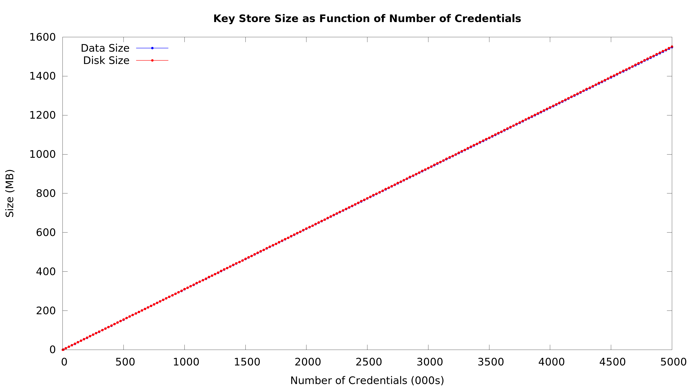

Database performance can often have a dramatic impact on
overall system performance. The [Key Store](../../yar/key_store) load tests were
created to explore how [Key Store](../../yar/key_store) size (# of credentials)
affects the [Key Store's](../../yar/key_store) performance. Also, the [Key Store](../../yar/key_store)
load tests provide an effective mechanism for understanding
how [CouchDB](http://couchdb.apache.org/) performs in general.

The instructions below assume you've worked through
[the basics of setting up a VM](...) to run load tests.

Massively Quick Intro to Running A Load Test
--------------------------------------------
A ton of effort has gone into automating the key store load testing process
so the instructions for running the test are actually really
simple. Instead of writing a description of these
instructions just follow the commands in the terminal window below.

~~~~~
>cd; cd yar; source bin/cfg4dev; cd tests
(env)>./provision.sh
<<<cut lots of messages>>>
Cleaning up...
 ---> 296a0d185246
Successfully built 296a0d185246
Removing intermediate container 5a44c1ec3b91
<<<cut lots of messages>>>
Removing intermediate container d984d433d10b
(env)>vagrant ssh
Welcome to Ubuntu 12.04 LTS (GNU/Linux 3.8.0-38-generic x86_64)

 * Documentation:  https://help.ubuntu.com/
Welcome to your Vagrant-built virtual machine.
Last login: Fri Sep 14 06:23:18 2012 from 10.0.2.2
vagrant@precise64:~$ cd /vagrant/tests-key-store-size/
vagrant@precise64:/vagrant/tests-key-store-size$ ./key_store_size_test.sh --mnc 100000
Initalizating Deployment
-- Removing all existing containers
-- Removing '~/.yar.deployment'
-- Removing '~/.yar.creds'
-- Removing '~/.yar.creds.random'
-- Deployment Location '/tmp/tmp.9jWj3OWX5p'
Creating Key Store
-- Key Store available @ '172.17.0.2:5984/creds'
-- Key Store data saved in '/tmp/tmp.9jWj3OWX5p'
Starting Test
-- Generating & uploading 1000 creds
-- Generating & uploading 5000 creds
-- Generating & uploading 19000 creds
-- Generating & uploading 25000 creds
-- Generating & uploading 25000 creds
-- Generating & uploading 25000 creds
Generating result graphs
-- Complete results in '/vagrant/tests-key-store-size/test-results/2014-05-05-01-01'
-- Summary report '/vagrant/tests-key-store-size/test-results/2014-05-05-01-01/test-results-summary.pdf'
vagrant@precise64:/vagrant/tests-key-store-size$
~~~~~

* below is a example of the kind of graphs you'll find in the
load test's summary report and
[here's](samples/sample-key-store-summary-report.pdf) a sample
of the full summary report

Next Steps
----------
* increase the number size of the key store by loading more
credentials with [key_store_size_test.sh's](key_store_size_test.sh)
--mnc option
